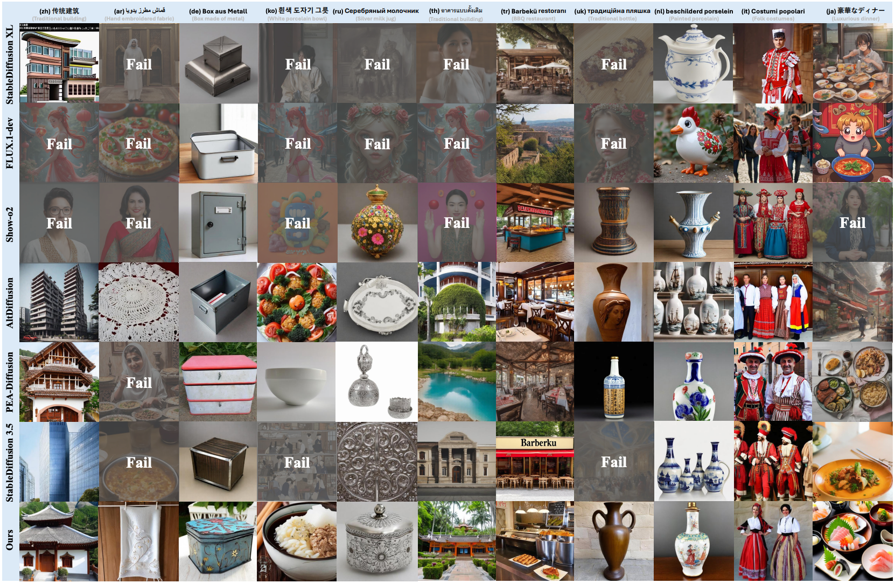

# [CVPR 2026] Where Culture Fades: Revealing the Cultural Gap in Text-to-Image Generation

  <a>Chuancheng Shi</a>1*, 
  <a>Shangze Li</a>2*, 
  <a>Shiming Guo</a>1, 
  <a>Simiao Xie</a>1, 
  <a>Wenhua Wu</a>1, 
  <a>Jingtong Dou</a>1, 
  <a>Chao Wu</a>2, 
  <a>Canran Xiao</a>3, 
  <a>Cong Wang</a>4, 
  <a>Zifeng Cheng</a>4, 
  <a>Fei Shen</a>5†, 
  <a>Tat-Seng Chua</a>5, 

  1 The University of Sydney, 
  2 Nanjing University of Science and Technology,
  3 Central South University
  4 Nanjing University,
  5 National University of Singapore  
  
  * Equal contribution &nbsp; | &nbsp; † Corresponding authors

)

---

## Image Showcase Gallery

